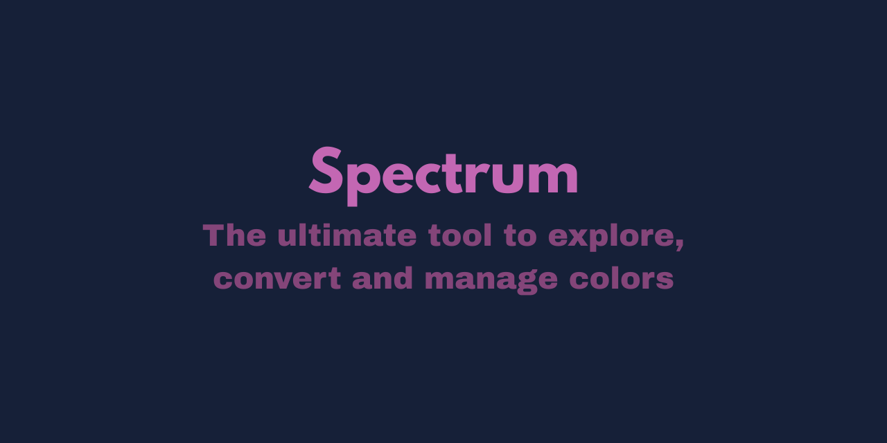

# Spectrum - Color Picker

Spectrum is a modern and intuitive web-based color picker tool designed for developers, designers, and anyone who works with colors. It provides a user-friendly interface to explore, convert, and manage colors effortlessly.

## Features

- **RGB Color Sliders:** Easily adjust the red, green, and blue values to find the perfect color.
- **HEX Input:** Directly input a HEX color code for precise color selection.
- **Real-time Color Display:** A large display shows the currently selected color in real-time.
- **Multiple Color Formats:** Instantly get the selected color in HEX, RGB, HSL, and CMYK formats.
- **Copy to Clipboard:** Click on any color format to copy the code to your clipboard.
- **Color Palette:** A predefined color palette is available for quick color selection.
- **Responsive Design:** The tool is fully responsive and works on all screen sizes.

## Technologies Used

- HTML
- CSS
- JavaScript

## Screenshots

 
